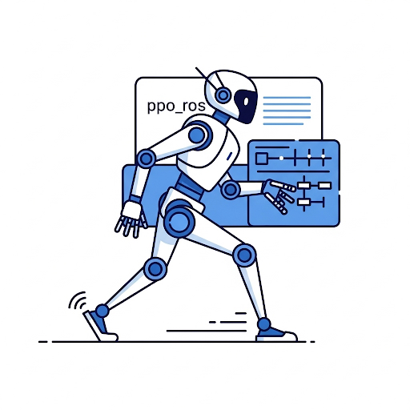
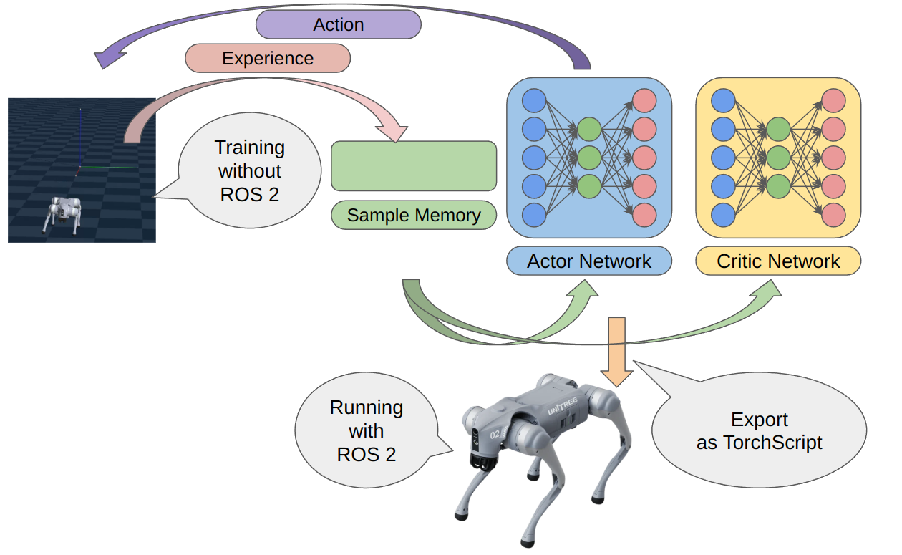
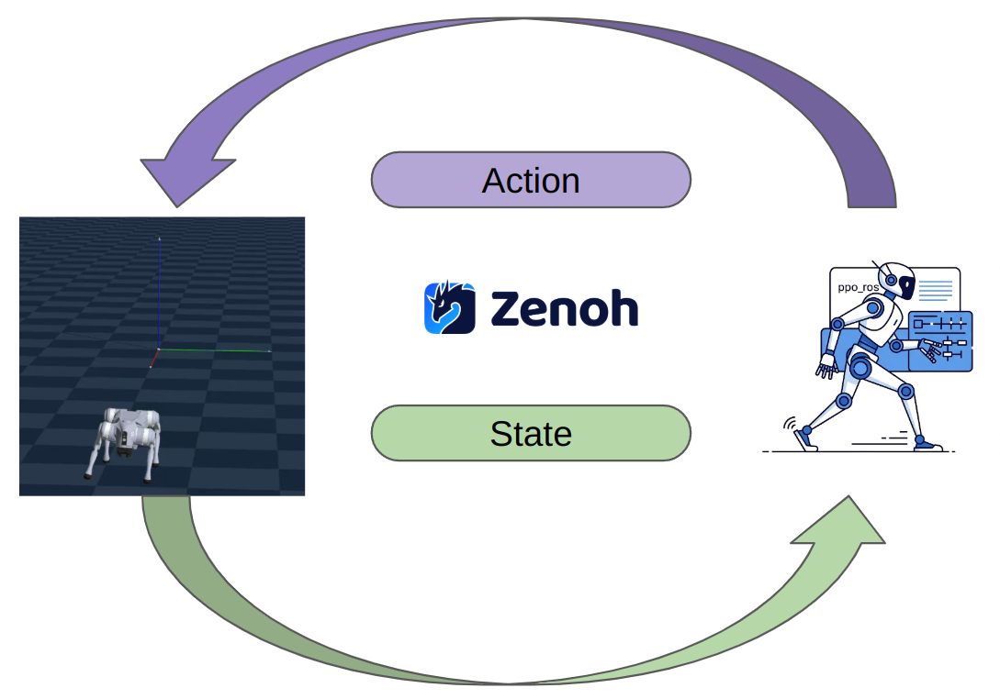
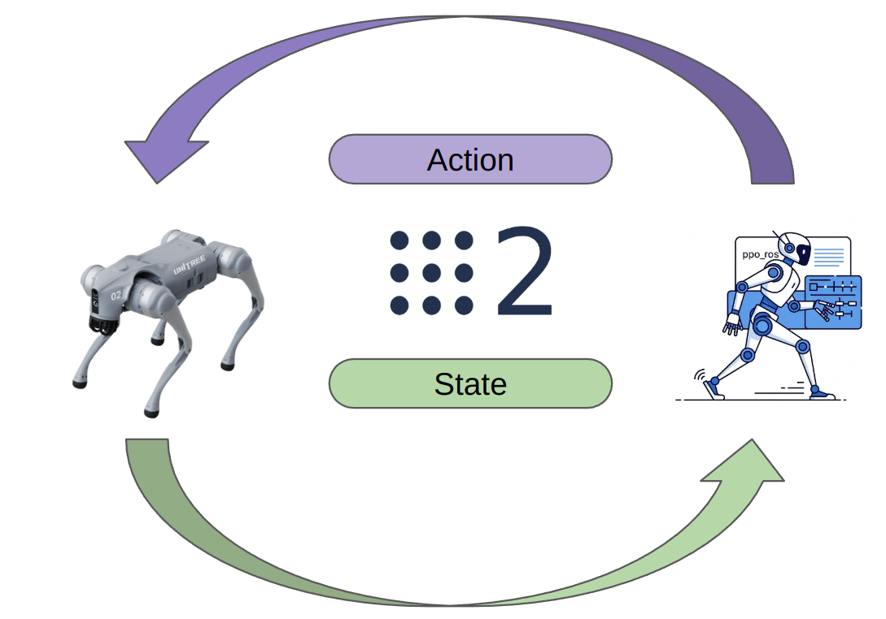

# ppo_ros

ROS 2 package for legged robot control!

Let's control your robot with proximal policy optimization!

## Architecture

This package support [proximal policy optimization.](https://arxiv.org/pdf/1707.06347)

Proximal policy optimization is one of a Actor-Critic algorithms, this node is the result of exporting the Actor network in torchscript format and integrating it with ROS 2.

ppo_ros node subscribe `control/state` topic and publish `control/action` topic.

## Simulator / Hardware interface

Interface is very simple.  
Interface is ROS 2 topic.

### Interface with Genesis simulator

Genesis and ppo_ros package communicate with ROS 2 topic over zenoh protocol.  

Genesis and genesis_ros library is completely independent from ROS 2, so we can speed up learning inside genesis.

### Interface with Real robot

If you want to use real robot, it's simple make a ROS 2 node that publish `control/state` and `control/action` topic wiht `torch_msgs/msg/Float32Tensor` type.

ppo_ros use [type adaptation feature in ROS 2.](https://developer.nvidia.com/blog/improve-perception-performance-for-ros-2-applications-with-nvidia-isaac-transport-for-ros/)

So, if you use GPU, you do not need to re-allocate tensor if you make Robot hardware driver node.
